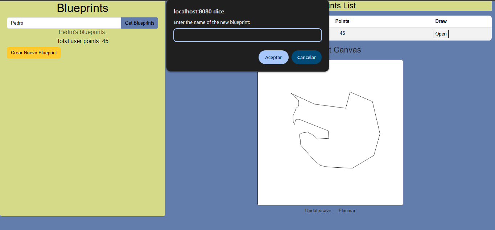
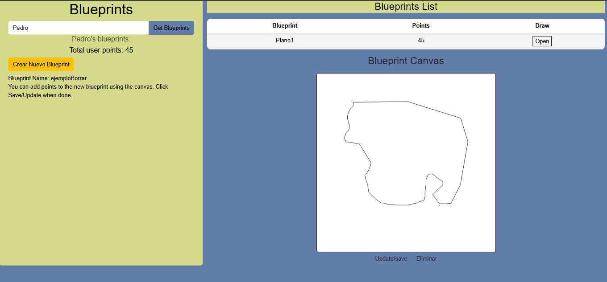
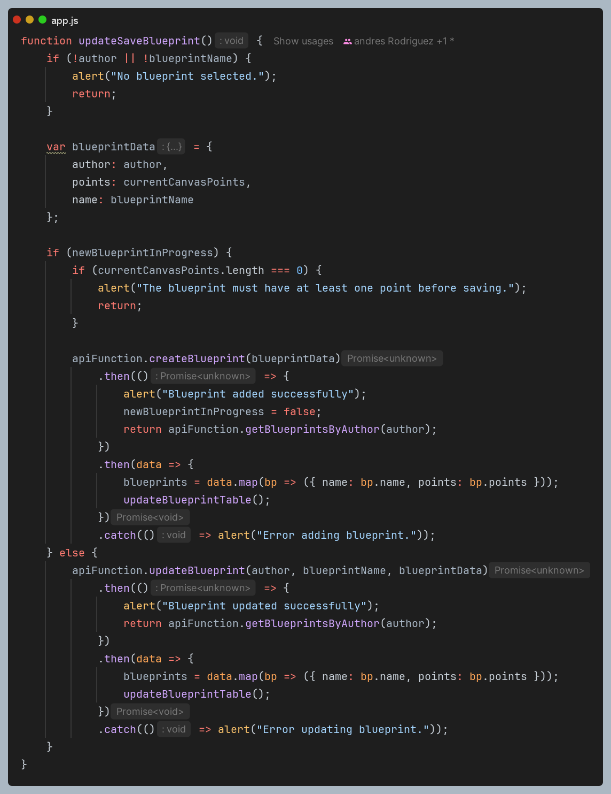

#### Escuela Colombiana de Ingeniería
#### Procesos de desarrollo de software - PDSW
#### Construción de un cliente 'grueso' con un API REST, HTML5, Javascript y CSS3. Parte II.

### Integrantes:
* Andrés Felipe Rodríguez Chaparro
* Santiago Guerra

## Desarrollo Laboratorio

1. Agregue al canvas de la página un manejador de eventos que permita capturar los 'clicks' realizados, bien sea a través del mouse, o a través de una pantalla táctil. Para esto, tenga en cuenta [este ejemplo de uso de los eventos de tipo 'PointerEvent'](aún no soportado por todos los navegadores) para este fin. Recuerde que a diferencia del ejemplo anterior (donde el código JS está incrustado en la vista), se espera tener la inicialización de los manejadores de eventos correctamente modularizado


4. Agregue lo que haga falta en sus módulos para que cuando se capturen nuevos puntos en el canvas abierto (si no se ha seleccionado un canvas NO se debe hacer nada):
	1. Se agregue el punto al final de la secuencia de puntos del canvas actual (sólo en la memoria de la aplicación, AÚN NO EN EL API!).
	2. Se repinte el dibujo.


5. Agregue el botón Save/Update. Respetando la arquitectura de módulos actual del cliente, haga que al oprimirse el botón:
	1. Se haga PUT al API, con el plano actualizado, en su recurso REST correspondiente.
	2. Se haga GET al recurso /blueprints, para obtener de nuevo todos los planos realizados.
	3. Se calculen nuevamente los puntos totales del usuario.


## Evidencias


	Para lo anterior tenga en cuenta:

	* jQuery no tiene funciones para peticiones PUT o DELETE, por lo que es necesario 'configurarlas' manualmente a través de su API para AJAX. Por ejemplo, para hacer una peticion PUT a un recurso /myrecurso:

	```javascript
    return $.ajax({
        url: "/mirecurso",
        type: 'PUT',
        data: '{"prop1":1000,"prop2":"papas"}',
        contentType: "application/json"
    });
    
	```
	Para éste note que la propiedad 'data' del objeto enviado a $.ajax debe ser un objeto jSON (en formato de texto). Si el dato que quiere enviar es un objeto JavaScript, puede convertirlo a jSON con: 
	
	```javascript
	JSON.stringify(objetojavascript),
	```
	* Como en este caso se tienen tres operaciones basadas en _callbacks_, y que las mismas requieren realizarse en un orden específico, tenga en cuenta cómo usar las promesas de JavaScript [mediante alguno de los ejemplos disponibles](http://codepen.io/hcadavid/pen/jrwdgK).

6. Agregue el botón 'Create new blueprint', de manera que cuando se oprima: 
	* Se borre el canvas actual.
	* Se solicite el nombre del nuevo 'blueprint' (usted decide la manera de hacerlo).
	
   	
   	
	Esta opción debe cambiar la manera como funciona la opción 'save/update', pues en este caso, al oprimirse la primera vez debe (igualmente, usando promesas):

	1. Hacer POST al recurso /blueprints, para crear el nuevo plano.
   		
	2. Hacer GET a este mismo recurso, para actualizar el listado de planos y el puntaje del usuario.
		

7. Agregue el botón 'DELETE', de manera que (también con promesas):
	* Borre el canvas.
	* Haga DELETE del recurso correspondiente.
	* Haga GET de los planos ahora disponibles.

   
### Criterios de evaluación

1. Funcional
	* La aplicación carga y dibuja correctamente los planos.
	* La aplicación actualiza la lista de planos cuando se crea y almacena (a través del API) uno nuevo.
	* La aplicación permite modificar planos existentes.
	* La aplicación calcula correctamente los puntos totales.
2. Diseño
	* Los callback usados al momento de cargar los planos y calcular los puntos de un autor NO hace uso de ciclos, sino de operaciones map/reduce.
	* Las operaciones de actualización y borrado hacen uso de promesas para garantizar que el cálculo del puntaje se realice sólo hasta cando se hayan actualizados los datos en el backend. Si se usan callbacks anidados se evalúa como R.
	
